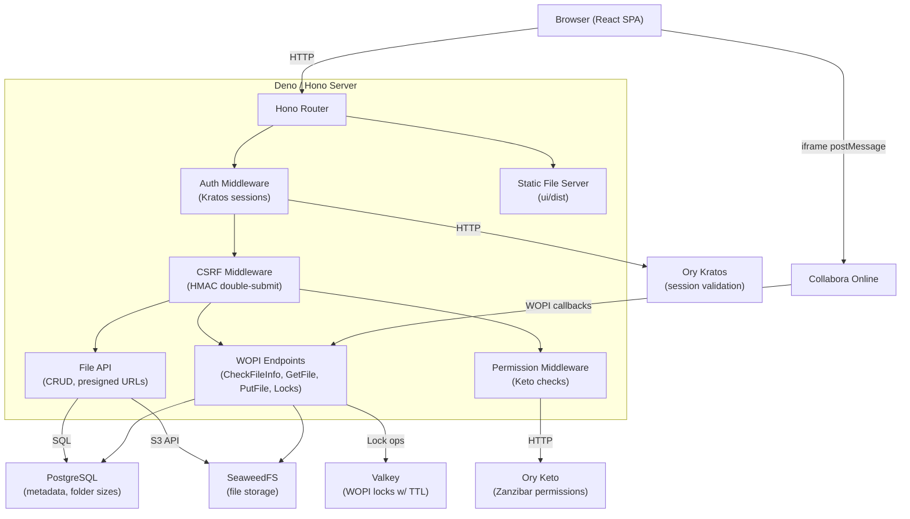
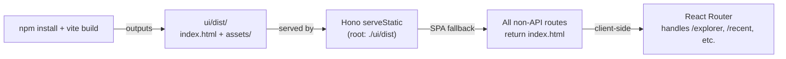
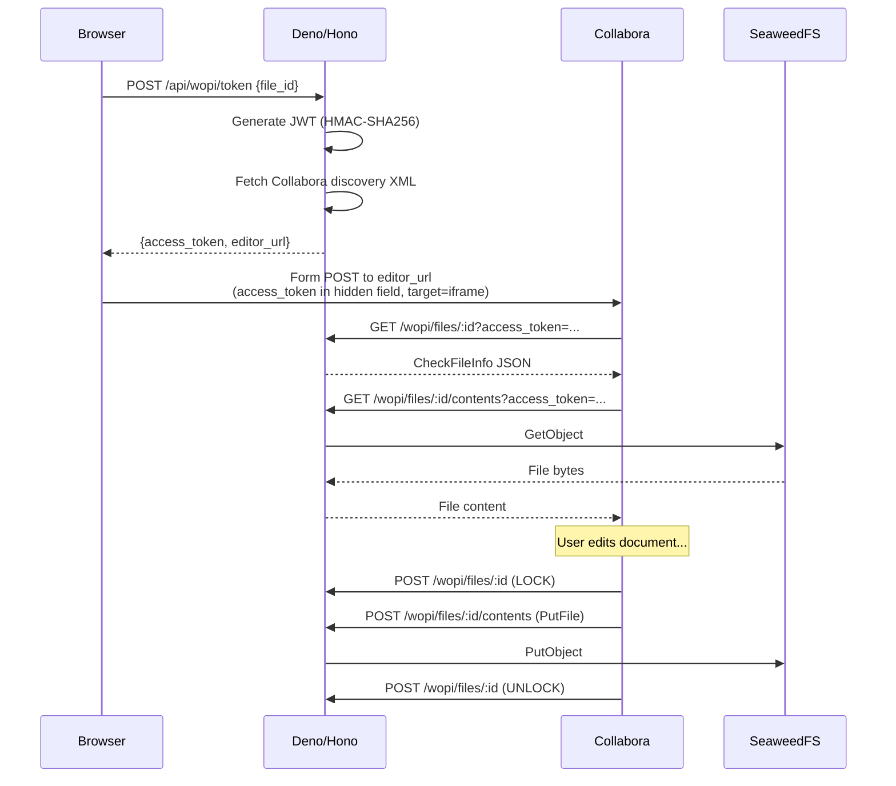

# Architecture

How the pieces fit together, and why there aren't very many of them.

---

## The Big Picture

Drive is one Deno binary. It serves a React SPA, proxies API calls to S3 and PostgreSQL, handles WOPI callbacks from Collabora, and validates sessions against Ory Kratos. No Django, no Celery, no Next.js, no BFF layer. One process, one binary, done.



## Request Lifecycle

Every request hits the Hono router in `main.ts`. The middleware stack is short and you can read the whole thing without scrolling:

1. **OpenTelemetry middleware** — tracing and metrics on every request.
2. **`/health`** — no auth, no CSRF. Returns `{ ok: true, time: "..." }`. K8s probes hit this.
3. **Auth middleware** — runs on everything except `/health`. Skips WOPI routes (they carry their own JWTs). Test mode (`DRIVER_TEST_MODE=1`) injects a fake identity.
4. **CSRF middleware** — validates HMAC double-submit cookies on mutating requests (`POST`, `PUT`, `PATCH`, `DELETE`) to `/api/*`. Skips WOPI routes.
5. **Route handlers** — the actual work.

From `main.ts`, the routing structure:

```
GET  /health                        Health check (no auth)
GET  /api/auth/session              Session info

GET  /api/files                     List files (with sort, search, pagination)
POST /api/files                     Create file (form-data or JSON metadata)
GET  /api/files/:id                 Get file metadata
PUT  /api/files/:id                 Rename or move
DELETE /api/files/:id               Soft delete
POST /api/files/:id/restore         Restore from trash
GET  /api/files/:id/download        Pre-signed download URL
POST /api/files/:id/upload-url      Pre-signed upload URL(s)
POST /api/files/:id/complete-upload Complete multipart upload

POST /api/folders                   Create folder
GET  /api/folders/:id/children      List folder contents

GET  /api/recent                    Recently opened files
GET  /api/favorites                 Favorited files
PUT  /api/files/:id/favorite        Toggle favorite
GET  /api/trash                     Deleted files

POST /api/admin/backfill            S3 -> DB backfill (internal only)

GET  /wopi/files/:id                CheckFileInfo (token auth)
GET  /wopi/files/:id/contents       GetFile (token auth)
POST /wopi/files/:id/contents       PutFile (token auth)
POST /wopi/files/:id                Lock/Unlock/Refresh/GetLock (token auth)

POST /api/wopi/token                Generate WOPI token (session auth)

/*                                  Static files from ui/dist
/*                                  SPA fallback (index.html)
```

## The SPA Lifecycle

The UI is a Vite-built React SPA. In production, it's static files in `ui/dist/`. Nothing fancy.



**Build step:**

```bash
cd ui && npm install && npx vite build
```

Outputs `ui/dist/index.html` and `ui/dist/assets/` with hashed JS/CSS bundles.

**Serving:**

Hono's `serveStatic` serves from `ui/dist` for any route that doesn't match an API endpoint. A second `serveStatic` call serves `index.html` as the SPA fallback — navigating to `/explorer/some-folder-id` returns the shell, React Router takes it from there.

**Development:**

In dev mode (`deno task dev`), both run simultaneously:
- `deno run -A --watch main.ts` — server with hot reload
- `cd ui && npx vite` — Vite dev server with HMR

The Vite dev server proxies API calls to the Deno server.

**Compiled binary:**

```bash
deno compile --allow-net --allow-read --allow-env --include ui/dist -o driver main.ts
```

`deno compile` bundles the JS entry point and the entire `ui/dist` directory into a single executable (~450KB JS + static assets). This is what gets deployed.

## WOPI Callback Flow

This is the part that confuses people. Collabora doesn't talk to the browser — it talks to your server. The browser is out of the loop during editing:



See [wopi.md](wopi.md) for the full breakdown.

## Auth Model

Two auth mechanisms, one server. This is the only slightly tricky part:

1. **Session auth** (most routes) — browser sends Ory Kratos session cookies. The middleware calls `GET /sessions/whoami` on Kratos. Invalid session? API routes get 401, page routes get a redirect to `/login`.

2. **Token auth** (WOPI routes) — Collabora doesn't have browser cookies (it's a separate server). WOPI endpoints accept a JWT `access_token` query parameter, HMAC-SHA256 signed, scoped to a specific file and user, 8-hour TTL.

The split happens in `server/auth.ts` based on URL prefix: anything under `/wopi/` skips session auth. WOPI handlers validate their own tokens.

## Data Flow

**File upload (pre-signed):**
1. Client sends metadata to `POST /api/files` (filename, mimetype, size, parent_id)
2. Server creates a `files` row, computes the S3 key
3. Client calls `POST /api/files/:id/upload-url` for a pre-signed PUT URL
4. Client uploads directly to S3 — file bytes never touch the server
5. Large files use multipart: multiple pre-signed URLs, then `POST /api/files/:id/complete-upload`
6. Folder sizes propagate up the ancestor chain via `propagate_folder_sizes()`

**File download (pre-signed):**
1. Client calls `GET /api/files/:id/download`
2. Server hands back a pre-signed GET URL
3. Client downloads directly from S3

The server never streams file content for regular uploads/downloads. The only time bytes flow through the server is WOPI callbacks — Collabora can't use pre-signed URLs, so we proxy those.

## Database

Two tables. That's it.

- **`files`** — the file registry. UUID PK, `s3_key` (unique), filename, mimetype, size, owner_id, parent_id (self-referencing for folder hierarchy), `is_folder` flag, timestamps, soft-delete via `deleted_at`.
- **`user_file_state`** — per-user state: favorites, last-opened timestamp. Composite PK on `(user_id, file_id)`.

Two PostgreSQL functions handle folder sizes:
- `recompute_folder_size(folder_id)` — recursive CTE that sums all descendant file sizes
- `propagate_folder_sizes(start_parent_id)` — walks up the ancestor chain, recomputing each folder

Migrations live in `server/migrate.ts` and run with `deno task migrate`.

## What's Not Here (Yet)

- **Rate limiting** — relying on ingress-level limits for now. Good enough until it isn't.
- **WebSocket** — no real-time updates between browser tabs. Collabora handles its own real-time editing internally, so this hasn't been a pain point yet.
